# 🛤️ Jerney — Blog Platform

A Gen-Z vibe blog platform built with a 3-tier architecture — React frontend, 
Node.js backend, and PostgreSQL database.

## ✨ Features

- 📝 Create blog posts with emoji vibes
- ✏️ Edit your existing posts
- 🗑️ Delete posts you're not feeling anymore
- 💬 Comment on posts
- 🎨 Gen-Z dark UI with glassmorphism and gradients

## 🏗️ Architecture

```
┌──────────────┐     ┌──────────────┐     ┌──────────────┐
│   Frontend   │────▶│   Backend    │────▶│  PostgreSQL   │
│   (React +   │◀────│  (Node.js +  │◀────│              │
│    Nginx)    │     │   Express)   │     │              │
│   Port 80    │     │  Port 5000   │     │  Port 5432   │
└──────────────┘     └──────────────┘     └──────────────┘
```

## 📁 Project Structure

```
Jerney/
├── frontend/                # React (Vite) frontend
│   ├── src/                 # React components & pages
│   ├── nginx.conf           # Nginx config for serving the app
│   └── package.json
├── backend/                 # Node.js Express API
│   ├── src/                 # Routes, DB connection
│   └── package.json
├── deploy/                  # EC2 deployment scripts
│   ├── setup.sh             # One-click EC2 setup script
│   └── jerney-nginx.conf    # Nginx reverse proxy config
└── README.md

```
## simple system design

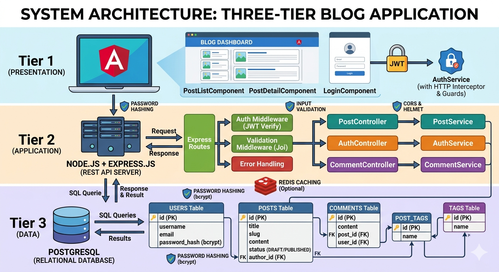


## Work Flow

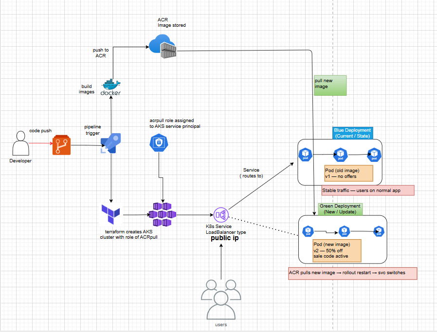

## Azure — AKS + Azure DevOps
## Advantages

1. Azure DevOps is the most mature CI/CD on any cloud. Boards, repos, pipelines, test plans — all in one place. For a team that also manages sprints and backlogs, it beats CodePipeline or Cloud Build hands down.

2. Best enterprise compliance out of the box. If you're in banking, healthcare, or government — Azure has the most certifications (ISO, SOC, PCI, HIPAA) pre-wired and policy-ready via Azure Policy.

## disAdvantages

1. Support is expensive and slow on lower tiers. Azure's basic support gives you no SLA. To get a human response under 4 hours you need the Developer plan at $29/month minimum — and even then, complex issues get bounced between teams. AWS support is faster at the same price tier.

2. ACR and AKS integration requires manual role assignment every time. The acrpull binding you see in your diagram has to be re-done manually when you rotate service principals or create new clusters — it's a common source of deploy failures

## AWS — EKS + CodePipeline 


## Advantages

1. Most global regions means your users get lower latency. AWS has 33 regions — more than Azure or GCP. If your app serves users in South Asia, Middle East, or Africa, AWS coverage is simply better for this deployment pattern.

2. Industry dominance (this is the reality)
   → Most companies run production on AWS

## disadvantages

1. The bill is a surprise every month. AWS pricing has over 500 different service price dimensions — data transfer, API calls, inter-AZ traffic, NAT gateway hours. Real-world bills consistently come in 30–40% higher than estimates. AWS's own cost calculator is notoriously hard to use accurately.

2. Time-consuming setup
→ Compared to AKS/GKE, EKS takes more effort


## Google Cloud Platform


## Advantages

1. Best Kubernetes experience (no debate)
→ Google created Kubernetes
→ Google Kubernetes Engine is the most polished

2.Auto-scaling & auto-healing is excellent
→ Less manual work → more reliability

2. The network is genuinely faster than everyone else. Google owns one of the largest private fibre networks on the planet — the same network that runs YouTube and Google Search. Traffic between GCP regions travels on Google's private backbone, not the public internet. This gives measurably lower latency for global applications.

## disAdvantages

1. Fewer regions than AWS for South Asia and emerging markets. GCP has 40 regions but gaps in parts of India and Southeast Asia where AWS has better coverage. If your users are concentrated in Andhra Pradesh or similar regions, latency may be measurably worse.

2. Less adoption compared to AWS/Azure

3. Enterprise support is weaker than Azure/AWS

## ☁️ Oracle Cloud



## Advantages

1. Compute is genuinely the cheapest of the four. OCI's bare metal and VM pricing is 30–60% cheaper than AWS and Azure for equivalent specs. And unlike competitors, the price is the same in every region worldwide — no surprise surcharges for running in Asia or Europe.

2. You pay roughly one-third of what AWS or GCP charge. For the same blue/green setup with 20 pods, OCI costs around $550/month vs $1,800 on AWS or GCP. At scale — say 200 pods — that gap becomes hundreds of thousands of dollars per year.

3. Strong for database-heavy apps
→ PostgreSQL workloads perform well

4. Oracle Database on OCI is the best database cloud on earth. If your application runs on Oracle Database — Exadata, Autonomous Database, RAC — no other cloud can touch OCI's performance and licensing advantages. Oracle runs its own software on its own hardware with dedicated support


## disAdvantages

1. Fewer regions and availability zones. OCI has about 46 regions but the density and redundancy within regions is lower than AWS. In some regions there are only 1–2 availability domains — meaning a true multi-AZ, high-availability setup is architecturally harder to achieve than on AWS or Azure.

1. Third-party tool integrations are limited. Tools like Datadog, PagerDuty, ArgoCD, and Helm charts have first-class AWS/GCP support but OCI integrations are often community-maintained and lag behind. Your monitoring and alerting setup will need more manual work.

## ✅ Final Conclusion

Choosing Microsoft Azure and Amazon Web Services is generally the better option because both provide a mature ecosystem, strong enterprise adoption, and robust CI/CD integrations. They are well-suited for running even large-scale, production-grade applications with high reliability and scalability.

In comparison, Google Cloud Platform (GKE) and Oracle Cloud Infrastructure offer good services but have relatively smaller ecosystems and fewer enterprise integrations. Oracle, in particular, can be more challenging for multi-zone architecture due to its limited availability zones, although it stands out for its cost-effectiveness, making it suitable for small applications or startups.

Overall, for large, scalable, and enterprise-level applications, Azure and AWS are the best choices, while Oracle is better for budget-focused, smaller workloads, and GCP is strong mainly for Kubernetes-focused use cases.

------------------------------------------------------------------------------------------------------------


------------------------------------------------------------------------------------------------------------------------------------------------------------------------------------------------------------------------


## my work

## CI/CD pipelines

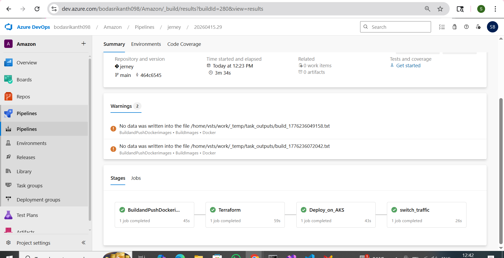

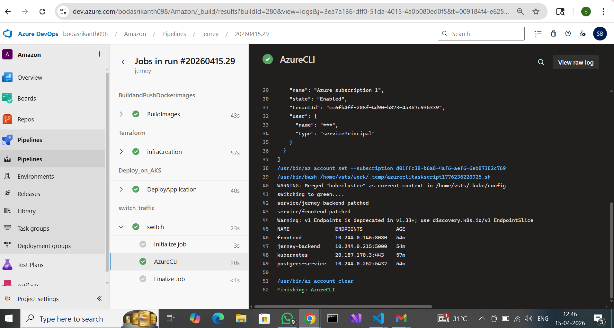


## Configured Approvals

1. Before switching traffic in a blue-green deployment, I configured manual approval gates to ensure that changes move to production only after validation and authorization from higher authorities, maintaining control and reducing risk.


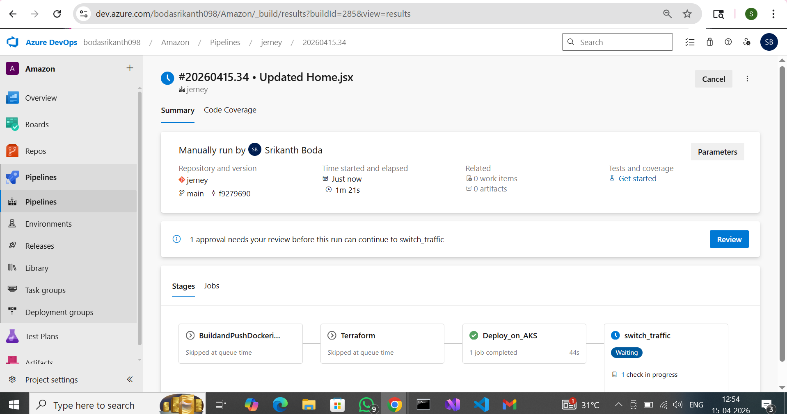

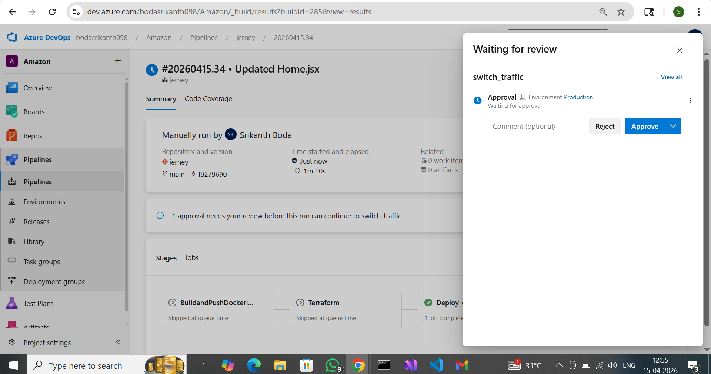


## Application

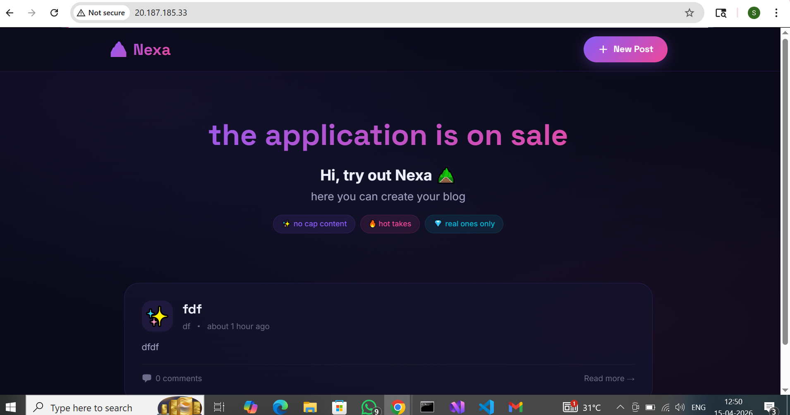

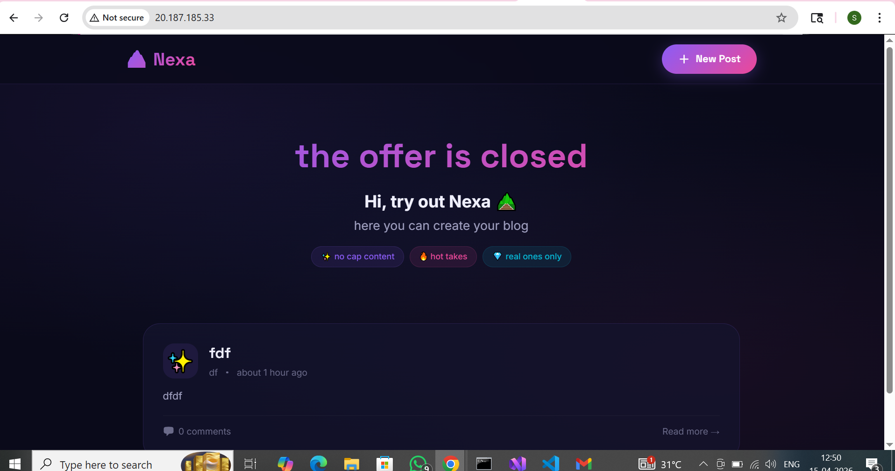

